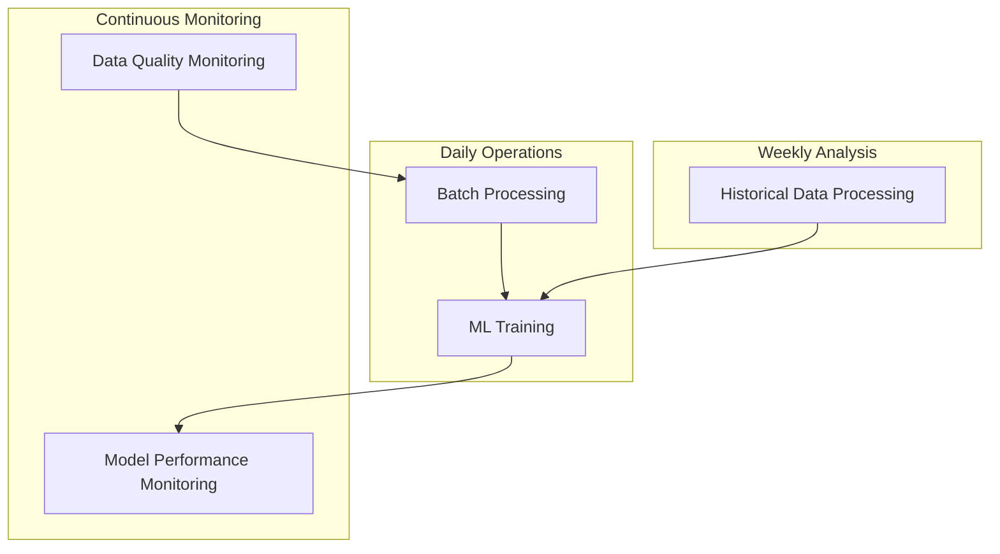

# 🚀 Airflow DAGs for IoT Smoke Detection Pipeline

This directory contains comprehensive Airflow DAGs that complete the end-to-end ML pipeline for IoT smoke detection.

## 📋 **DAG Overview**

### **1. 🤖 ML Training & Model Management DAG**
- **File**: `ml_training_dag.py`
- **Schedule**: Daily at 2 AM
- **Purpose**: Automated ML model training and deployment
- **Features**:
  - Automatic model training with validation
  - Model performance testing
  - Production deployment
  - Model versioning and cleanup
  - ML API notification

### **2. 📊 Data Quality Monitoring DAG**
- **File**: `data_quality_monitoring_dag.py`
- **Schedule**: Every 6 hours
- **Purpose**: Continuous data quality monitoring
- **Features**:
  - Data completeness validation
  - Anomaly detection in sensor readings
  - Data type and range validation
  - Quality scoring and reporting
  - Alert generation for quality issues

### **3. 🔍 Model Performance Monitoring DAG**
- **File**: `model_performance_monitoring_dag.py`
- **Schedule**: Every 12 hours
- **Purpose**: ML model performance tracking
- **Features**:
  - ML API health monitoring
  - Model accuracy testing
  - Prediction pattern analysis
  - Drift detection
  - Performance degradation alerts

### **4. 📈 Historical Data Processing DAG**
- **File**: `historical_data_processing_dag.py`
- **Schedule**: Weekly on Sundays at 3 AM
- **Purpose**: Historical data analysis and insights
- **Features**:
  - Historical data discovery
  - ML processing of historical datasets
  - Pattern analysis and insights generation
  - Report generation
  - Data cleanup and archival

### **5. 🔧 Enhanced Batch Processing DAG**
- **File**: `smoke_detection_dag.py` (updated)
- **Schedule**: Daily at 6 AM
- **Purpose**: Core batch data processing
- **Features**:
  - Feature engineering
  - Batch metrics computation
  - Data transformation

## 🗓️ **DAG Schedule Overview**

```
Time    | DAG                           | Frequency
--------|-------------------------------|----------
02:00   | ML Training                   | Daily
06:00   | Batch Processing              | Daily
Every 6h| Data Quality Monitoring       | 4x Daily
Every 12h| Model Performance Monitoring | 2x Daily
Sun 03:00| Historical Data Processing   | Weekly
```

## 📊 **DAG Dependencies and Flow**



## 🎯 **Key Features Implemented**

### **✅ Automated ML Pipeline**
- **Model Training**: Automatic daily training with validation
- **Model Deployment**: Automated deployment to production
- **Model Monitoring**: Continuous performance tracking
- **Model Versioning**: Automatic versioning and cleanup

### **✅ Data Quality Assurance**
- **Completeness Checks**: Missing data detection
- **Anomaly Detection**: Statistical outlier identification
- **Range Validation**: Sensor reading validation
- **Quality Scoring**: Overall data quality metrics

### **✅ Performance Monitoring**
- **API Health Checks**: ML service availability monitoring
- **Accuracy Testing**: Model performance validation
- **Drift Detection**: Model degradation identification
- **Alert Generation**: Automated issue notifications

### **✅ Historical Analysis**
- **Pattern Discovery**: Temporal and environmental patterns
- **Insights Generation**: Actionable insights from historical data
- **Performance Analysis**: Historical model performance
- **Report Generation**: Comprehensive analysis reports

## 🚀 **Getting Started**

### **1. Access Airflow UI**
```bash
# Start the pipeline
docker-compose up --build

# Access Airflow UI
http://localhost:8080
# Credentials: admin/admin
```

### **2. Enable DAGs**
1. Navigate to Airflow UI
2. Toggle ON the following DAGs:
   - `ml_training_pipeline`
   - `data_quality_monitoring`
   - `model_performance_monitoring`
   - `historical_data_processing`
   - `smoke_detection_batch_pipeline`

### **3. Trigger Initial Runs**
```bash
# Trigger ML training (first time)
airflow dags trigger ml_training_pipeline

# Trigger data quality check
airflow dags trigger data_quality_monitoring

# Trigger historical analysis
airflow dags trigger historical_data_processing
```

## 📁 **Output Locations**

### **Reports and Results**
```
/opt/airflow/data/
├── quality_reports/           # Data quality reports
├── performance_reports/       # Model performance reports
├── insights_reports/          # Historical insights reports
├── historical_ml_results/     # Historical ML processing results
└── processed_stream/          # Stream processing outputs
```

### **ML Models**
```
/opt/airflow/ml/models/
├── best_model.pkl            # Production model
├── model_dag_YYYYMMDD_HHMMSS.pkl  # Versioned models
└── README.md                 # Model documentation
```

## 🔧 **Configuration**

### **Environment Variables**
```bash
# ML Training Configuration
ML_AUTO_TRAIN_ON_STARTUP=true
ML_TRAINING_INTERVAL_HOURS=24

# ML API Configuration
ML_API_URL=http://ml_api:5000
ML_API_TIMEOUT=30

# Data Quality Thresholds
DATA_QUALITY_MIN_SCORE=80
ANOMALY_DETECTION_THRESHOLD=5

# Report Retention
REPORT_RETENTION_DAYS=30
```

### **DAG Configuration**
Each DAG can be configured by modifying the respective Python files:
- Schedules can be changed in the `schedule_interval` parameter
- Thresholds can be adjusted in the task functions
- Retry policies can be modified in `default_args`

## 📊 **Monitoring and Alerts**

### **Data Quality Alerts**
- **Critical**: Overall quality score < 70%
- **Warning**: Anomaly rate > 10%
- **Info**: Completeness < 90% for any sensor

### **Model Performance Alerts**
- **Critical**: Model accuracy < 70%
- **Warning**: Response time > 5 seconds
- **Info**: Drift indicators detected

### **System Health Alerts**
- **Critical**: ML API not responding
- **Warning**: Training failures
- **Info**: Storage cleanup needed

## 🎯 **Benefits of DAG Implementation**

### **✅ Complete Automation**
- **No Manual Intervention**: All processes run automatically
- **Scheduled Operations**: Optimal timing for different tasks
- **Error Handling**: Automatic retries and failure notifications
- **Resource Management**: Efficient resource utilization

### **✅ Comprehensive Monitoring**
- **End-to-End Visibility**: Monitor entire pipeline health
- **Proactive Alerts**: Early detection of issues
- **Performance Tracking**: Continuous improvement insights
- **Quality Assurance**: Automated data validation

### **✅ Operational Excellence**
- **Scalable Architecture**: Easy to add new DAGs
- **Maintainable Code**: Well-structured and documented
- **Audit Trail**: Complete operation history
- **Disaster Recovery**: Automated backup and cleanup

## 🔄 **DAG Execution Flow**

### **Daily Operations (Weekdays)**
```
02:00 - ML Training Pipeline
  ├── Check training data
  ├── Train new model
  ├── Validate performance
  ├── Deploy to production
  └── Notify ML API

06:00 - Batch Processing Pipeline
  ├── Feature engineering
  ├── Compute metrics
  └── Data transformation

Every 6h - Data Quality Monitoring
  ├── Check data availability
  ├── Analyze quality metrics
  ├── Detect anomalies
  ├── Generate reports
  └── Check alerts

Every 12h - Model Performance Monitoring
  ├── Check ML API health
  ├── Test model predictions
  ├── Analyze patterns
  ├── Generate reports
  └── Check alerts
```

### **Weekly Operations (Sundays)**
```
03:00 - Historical Data Processing
  ├── Discover historical data
  ├── Process with ML models
  ├── Analyze patterns
  ├── Generate insights
  └── Cleanup old reports
```

## 🎉 **Summary**

The implemented DAGs provide:

✅ **Complete ML Lifecycle Management** - From training to monitoring  
✅ **Automated Data Quality Assurance** - Continuous validation and alerts  
✅ **Comprehensive Performance Monitoring** - Model health and drift detection  
✅ **Historical Analysis and Insights** - Pattern discovery and recommendations  
✅ **Operational Excellence** - Automated scheduling, retries, and cleanup  

**The Airflow DAGs complete the end-to-end ML pipeline, ensuring reliable, automated, and monitored operations!** 🚀🤖📊
