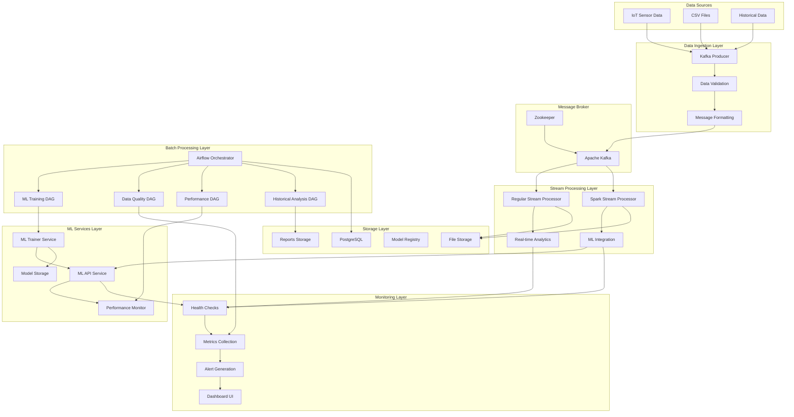

# 🏗️ IoT Smoke Detection Pipeline - Complete Architecture

This document provides a comprehensive overview of the enterprise-grade IoT smoke detection data pipeline architecture.

## 🎯 **Architecture Overview**

The system implements a **microservices-based, event-driven architecture** with complete automation, monitoring, and ML integration for real-time smoke detection.

### **🔄 Core Principles**
- **Microservices Architecture**: Independent, scalable services
- **Event-Driven Processing**: Kafka-based message streaming
- **Automated ML Pipeline**: End-to-end ML lifecycle management
- **Self-Healing Systems**: Automatic recovery and monitoring
- **Enterprise Monitoring**: Comprehensive observability

## 🏛️ **System Architecture Diagram**



## 🔧 **Service Architecture**

### **1. Data Ingestion Layer**

#### **Kafka Producer Service**
- **Purpose**: Ingest IoT sensor data into the pipeline
- **Technology**: Python, Kafka Client
- **Features**:
  - CSV data streaming simulation
  - Message validation and formatting
  - Error handling and retries
  - Configurable data rates

#### **Data Validation**
- **Schema validation**: Ensure data structure consistency
- **Range validation**: Validate sensor reading ranges
- **Quality checks**: Detect missing or corrupted data

### **2. Message Broker Layer**

#### **Apache Kafka**
- **Purpose**: Reliable message streaming and buffering
- **Configuration**:
  - Topic: `smoke_sensor_data`
  - Partitions: Configurable for scaling
  - Replication: Fault tolerance
  - Retention: Configurable data retention

#### **Zookeeper**
- **Purpose**: Kafka cluster coordination
- **Features**: Service discovery, configuration management

### **3. Stream Processing Layer**

#### **Regular Stream Processor**
- **Purpose**: Basic real-time analytics
- **Technology**: Python, Kafka Consumer
- **Features**:
  - Real-time data consumption
  - Basic statistical calculations
  - Anomaly detection
  - Data transformation

#### **Spark Stream Processor**
- **Purpose**: Advanced analytics with ML integration
- **Technology**: Apache Spark, PySpark
- **Features**:
  - Windowed analytics (5-minute windows)
  - 25+ statistical measures
  - ML prediction integration
  - Data quality monitoring
  - Alert generation

### **4. ML Services Layer**

#### **ML Trainer Service**
- **Purpose**: Automated model training and management
- **Technology**: Python, Scikit-learn, Schedule
- **Features**:
  - Automatic training on startup
  - Scheduled retraining (daily)
  - Model validation and testing
  - Version management
  - Performance tracking

#### **ML API Service**
- **Purpose**: Real-time ML predictions
- **Technology**: Flask, Scikit-learn
- **Features**:
  - REST API endpoints
  - Real-time predictions
  - Health monitoring
  - Model information
  - Batch predictions

### **5. Batch Processing Layer**

#### **Airflow Orchestrator**
- **Purpose**: Workflow orchestration and scheduling
- **Technology**: Apache Airflow
- **Features**:
  - DAG-based workflows
  - Scheduled execution
  - Dependency management
  - Error handling and retries

#### **ML Training DAG**
- **Schedule**: Daily at 2 AM
- **Tasks**:
  - Data validation
  - Model training
  - Performance validation
  - Model deployment
  - Cleanup and notification

#### **Data Quality DAG**
- **Schedule**: Every 6 hours
- **Tasks**:
  - Data availability check
  - Quality metrics calculation
  - Anomaly detection
  - Report generation
  - Alert checking

#### **Performance Monitoring DAG**
- **Schedule**: Every 12 hours
- **Tasks**:
  - ML API health check
  - Model accuracy testing
  - Pattern analysis
  - Performance reporting
  - Alert generation

#### **Historical Analysis DAG**
- **Schedule**: Weekly on Sundays
- **Tasks**:
  - Historical data discovery
  - ML processing
  - Pattern analysis
  - Insights generation
  - Data cleanup

### **6. Storage Layer**

#### **PostgreSQL**
- **Purpose**: Metadata and workflow storage
- **Usage**:
  - Airflow metadata
  - DAG execution history
  - Configuration storage

#### **File Storage**
- **Purpose**: Data and model persistence
- **Structure**:
  ```
  /app/data/
  ├── smoke_detection_iot.csv    # Source data
  ├── processed_stream/          # Stream outputs
  ├── quality_reports/           # Quality reports
  ├── performance_reports/       # Performance reports
  └── insights_reports/          # Analysis reports
  
  /app/ml/models/
  ├── best_model.pkl            # Production model
  └── model_YYYYMMDD_HHMMSS.pkl # Versioned models
  ```

### **7. Monitoring Layer**

#### **Health Checks**
- **Service health**: Container status monitoring
- **API health**: Endpoint availability checks
- **Data health**: Data flow monitoring

#### **Metrics Collection**
- **System metrics**: CPU, memory, disk usage
- **Application metrics**: Processing rates, latencies
- **Business metrics**: Fire detection rates, accuracy

#### **Alert Generation**
- **Critical alerts**: Service failures, data quality issues
- **Warning alerts**: Performance degradation, anomalies
- **Info alerts**: Scheduled maintenance, reports

## 🔄 **Data Flow Architecture**

### **Real-time Data Flow**
```
IoT Sensors → CSV Files → Kafka Producer → Kafka Topic → Stream Processors
                                                              ↓
                                                        Analytics Engine
                                                        ├── Statistical Metrics
                                                        ├── Anomaly Detection
                                                        └── ML Predictions
                                                              ↓
                                                        Output Storage
                                                        ├── Real-time Logs
                                                        ├── Alert Generation
                                                        └── Dashboard Updates
```

### **Batch Processing Flow**
```
Scheduled Triggers → Airflow DAGs → Task Execution
                                         ↓
                                   Processing Tasks
                                   ├── Data Quality Analysis
                                   ├── ML Model Training
                                   ├── Performance Monitoring
                                   └── Historical Analysis
                                         ↓
                                   Report Generation
                                   ├── Quality Reports
                                   ├── Performance Reports
                                   ├── Training Reports
                                   └── Insights Reports
```

### **ML Pipeline Flow**
```
Training Data → Feature Engineering → Model Training → Validation
                                                           ↓
                                                    Model Deployment
                                                           ↓
                                              Production Predictions
                                                           ↓
                                              Performance Monitoring
                                                           ↓
                                                  Retraining Trigger
```

## 🚀 **Deployment Architecture**

### **Container Orchestration**
```yaml
Services:
  - postgres:        Database service
  - zookeeper:       Kafka coordination
  - kafka:           Message broker
  - kafka_producer:  Data ingestion
  - stream_processor: Basic analytics
  - spark_stream_processor: Advanced analytics
  - ml_trainer:      Model training
  - ml_api:          Prediction service
  - airflow:         Workflow orchestration

Volumes:
  - postgres_data:   Database persistence
  - spark_data:      Spark checkpoints
  - spark_logs:      Spark logs
  - ml_models:       Model storage
  - ml_logs:         ML service logs

Networks:
  - default:         Inter-service communication
```

### **Service Dependencies**
```
Startup Order:
1. postgres
2. zookeeper
3. kafka
4. ml_trainer (trains initial models)
5. ml_api (serves predictions)
6. kafka_producer (starts data ingestion)
7. stream_processor (basic analytics)
8. spark_stream_processor (ML analytics)
9. airflow (workflow orchestration)
```

## 📊 **Scalability Architecture**

### **Horizontal Scaling**
- **Kafka**: Multiple partitions and brokers
- **Stream Processing**: Multiple consumer instances
- **ML API**: Load balancer with multiple instances
- **Airflow**: Multiple workers

### **Vertical Scaling**
- **Spark**: Configurable executor memory and cores
- **ML Training**: Adjustable batch sizes
- **Database**: Configurable connection pools

### **Performance Optimization**
- **Caching**: ML prediction caching
- **Batching**: Batch processing for efficiency
- **Compression**: Data compression for storage
- **Indexing**: Database query optimization

## 🛡️ **Reliability Architecture**

### **Fault Tolerance**
- **Service Restart**: Automatic container restart
- **Data Persistence**: Volume-based data storage
- **Graceful Degradation**: Fallback mechanisms
- **Circuit Breakers**: API failure handling

### **Monitoring & Alerting**
- **Health Checks**: Container and service health
- **Metrics Collection**: Performance monitoring
- **Alert Generation**: Automated notifications
- **Log Aggregation**: Centralized logging

### **Backup & Recovery**
- **Data Backup**: Automated data snapshots
- **Model Versioning**: Multiple model versions
- **Configuration Backup**: Environment preservation
- **Disaster Recovery**: Service restoration procedures

## 🔒 **Security Architecture**

### **Network Security**
- **Container Isolation**: Docker network isolation
- **Port Management**: Minimal exposed ports
- **Internal Communication**: Secure inter-service communication

### **Data Security**
- **Data Validation**: Input sanitization
- **Access Control**: Service-level permissions
- **Audit Logging**: Operation tracking

### **API Security**
- **Authentication**: API key management
- **Rate Limiting**: Request throttling
- **Input Validation**: Parameter validation

## 🎯 **Architecture Benefits**

### **✅ Scalability**
- Independent service scaling
- Horizontal and vertical scaling options
- Load balancing capabilities

### **✅ Reliability**
- Fault-tolerant design
- Automatic recovery mechanisms
- Comprehensive monitoring

### **✅ Maintainability**
- Modular architecture
- Clear service boundaries
- Comprehensive documentation

### **✅ Extensibility**
- Plugin-based architecture
- API-driven integration
- Configurable components

### **✅ Performance**
- Optimized data flow
- Efficient resource utilization
- Caching and batching strategies

---

**This architecture provides a robust, scalable, and maintainable foundation for enterprise-grade IoT smoke detection with complete automation and monitoring capabilities.**
